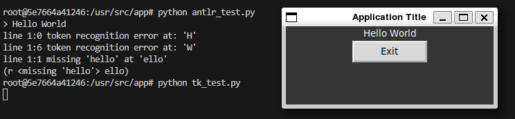

# Proyecto 1: Análisis Semántico
---

**Universidad del Valle de Guatemala**\
**Facultad de Ingeniería**\
**Departamento de Ciencias de la Computación**\
**Construcción de Compiladores**

---

## Autores
- Diego Leiva
- Pablo Orellana

## Docker Test

